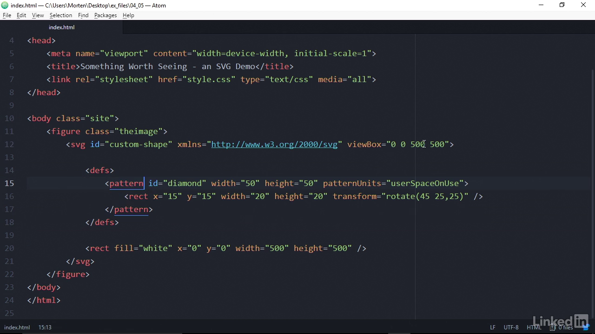

Illustrator Or Sketch

```javascript
<svg xmlns="http://www.w3.org/2000/svg">

</svg>

<figure>
    <figcaption> a caption for the figure  </figcaption>
</figure>

// for grouping
<g>

</g>


// declare a svg but not showing them !!! and use it by <use/>
<symbol id="#symbol-icon">
</symbol>

<use href="#symbol-icon" />


```

```javascript

 // shapes overview

    <line x1="point1" y1="point1" x2="point2" y2="point2">
    <rect x="top" y="left" width="" height="" rx="radius" ry="radius" >
    <circle cx="center" cy="center" r="">
    <ellipse cx="" cy="" rx="" ry="">
    <polyline points="x1,y1 x2,y2 x3,y3">
    <polygon points="x1,y1 x2,y2 x3,y3"> //end automatically connected
    <text x="" y=""> Hello world !  </text>
    <path d="[path instruction]"> // not human readable !


    <tspan>=> <text>  hello <tspan x="" dy="" > world ! </tspan> </text>

```


```javascript
 <image
 x=""
 y=""
 width=""
 height=""
 xlink:href="path/to/image.png"
 preserveAspectRatio="xMinYMin"
 >

```

```javascript
 <rect  x  y width height transform="rotate(45 0,0)"> //0,0 is svg anchor point not the selected shape

```


```javascript
 stroke-dasharray="10,10"
 stroke-dashoffset="state.offset" // state in react animations the name
```

```javascript
 Marker

  <defs>
<marker id="arrow"


viewBox ="0 0 100 100"
refX="4"
refY="4"
markerWidth="10"
markerHeight="10"
orient ="auto"

>

<line   marker-end="url(#arrow)" marker-start="url(#arrow)" marker-mid="url(#arrow)">

<polygon points="0,0, 10,20 0,10 4,5">

</marker>


  </defs>
```



